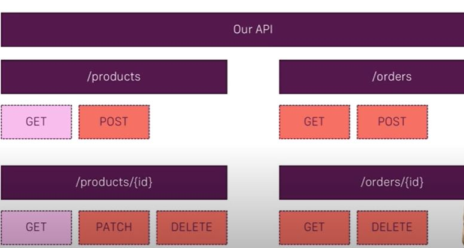
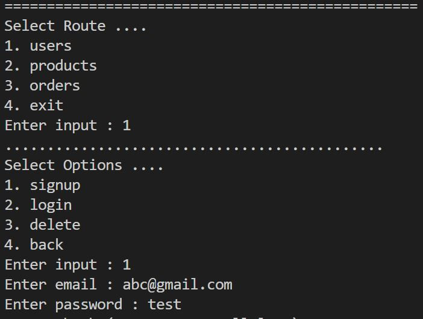

# Shop-api
This is a basic api which handles user authentication and orders and product related queries.

## Design of API

* ### In the above design routes of __Login__ and __Signup__ are also added.

## Command Line Utility (python demo.py)

* After Signup and Login ,it will give a JWT token.
* Use that token for requesting any route.

## Steps to use
* Bundle the things using webpack
* Run docker file for image creation of this api
* Deploy this image on GCP
* Update the URL of api in the __demo.py__.
* Use the Command Line utility.
